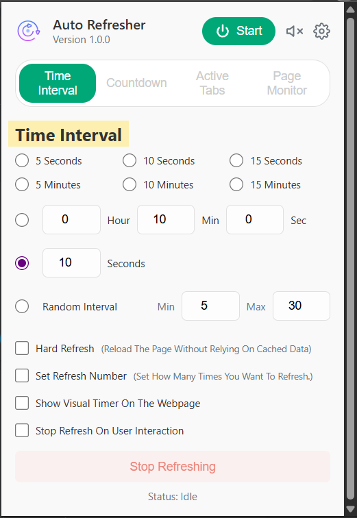

# Auto Refresher Pro

A feature-rich Chrome extension for automatically refreshing web pages, built with modern Manifest V3 architecture.

## Overview

This project is a custom-built auto-refresh extension inspired by popular tools in the Chrome Web Store. It was developed to explore the fundamentals of Chrome extension development, including the interaction between service workers, content scripts, and popups.

## Features

*   **Flexible Timing:** Set refresh intervals with predefined values (5s, 10m, etc.) or custom user input.
*   **Randomized Intervals:** Option to set a random refresh time between a specified minimum and maximum to better simulate human behavior.
*   **Favicon Countdown Timer:** Provides a non-intrusive visual countdown timer directly in the tab's icon.
*   **Refresh Countdown:** Automatically stop refreshing after a set number of reloads.
*   **Hard Refresh:** Option to bypass the local cache for a complete reload of page resources.
*   **Stop on Interaction:** The timer automatically stops if the user clicks, scrolls, or types on the page.

## Technical Details

*   **Manifest V3:** Built on the latest, most secure Chrome extension platform.
*   **Event-Driven Background Script:** Uses `chrome.alarms` and event listeners for maximum efficiency and reliability, even when the service worker is dormant.
*   **Dynamic Favicon:** The `content.js` script leverages the HTML `<canvas>` API to dynamically draw the countdown and update the favicon in real-time.
*   **Separation of Concerns:** A clear and maintainable architecture separates background logic, UI interaction, and DOM manipulation.

## How to Install Locally

1.  Clone this repository: `git clone https://github.com/YOUR_USERNAME/your-repo-name.git`
2.  Open Chrome and navigate to `chrome://extensions`.
3.  Enable "Developer mode" in the top-right corner.
4.  Click "Load unpacked" and select the cloned project folder.
5.  The extension's icon will appear in your toolbar!

